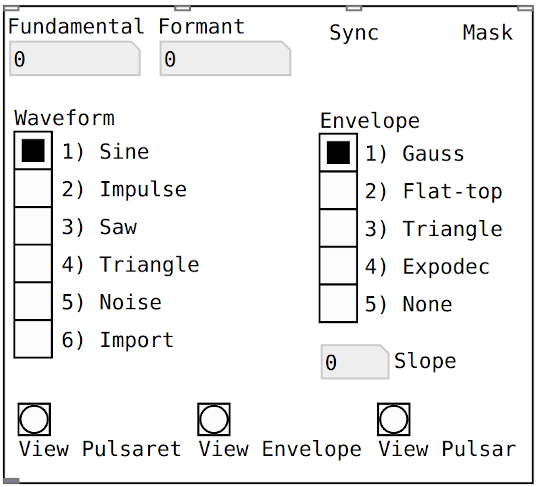

# pulsar~

An implementation in Pure Data of Pulsar Synthesis as described by Curtis Roads (2000). https://archive.org/details/soundcompwithpulsars/page/n1/mode/2up

Abstracting Pulsar synthesis into an object in pure data expands the possibilities for control and simultaneous pulsar streams. See the help patch for examples.

